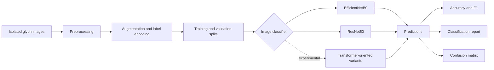

<div align="center">

# GPLC

### Ancient Palm-Leaf Glyph Classification

Research benchmark and reference implementations for isolated glyph classification across Khmer, Balinese, and Sundanese palm-leaf manuscripts.

**A research component of [PALM-SEA](https://ruisju111.github.io/PLA/)**  
**Project led by Dr. Nimol Thuon**

[](https://doi.org/10.1007/978-3-031-21648-0_5)


[](LICENSE)


[Overview](#overview) · [Publication](#publication) · [Architecture](#research-workflow) · [Dataset](#dataset) · [Models](#model-coverage) · [Getting Started](#getting-started) · [Citation](#citation)

</div>

---

## Overview

**GPLC** provides a compact research scaffold for studying isolated glyph classification in digitized palm-leaf manuscripts. The work addresses a difficult low-resource setting in which glyph appearance is affected by manuscript degradation, writing-style variation, background noise, class imbalance, and limited labeled data.

The repository accompanies the ICFHR 2022 paper **“Improving Isolated Glyph Classification Task for Palm Leaf Manuscripts.”** It brings together data-preparation utilities, augmentation, convolutional baselines, experimental attention-based model scaffolds, training helpers, and evaluation tools.

GPLC is part of **PALM-SEA**, a broader research initiative focused on the computational analysis, recognition, and digital preservation of Southeast Asian palm-leaf manuscripts.

> [!IMPORTANT]
> This repository is a **research code snapshot**, not a packaged production application. EfficientNetB0 and ResNet50 baselines are implemented; several transformer-oriented files are experimental scaffolds that require further implementation and validation. Dataset images, prepared splits, trained weights, and internal PALM-SEA systems are not bundled.

## Research Context

Isolated glyph classification assigns a script class to a cropped character image. Palm-leaf material makes this task particularly challenging because the same glyph can vary substantially across writers, collections, imaging conditions, and degrees of physical deterioration.

The project studies four complementary areas:

- image preprocessing and manuscript-specific data preparation;
- augmentation for limited and imbalanced training data;
- CNN and attention-oriented image-classification architectures;
- evaluation across Khmer, Balinese, and Sundanese scripts.

<p align="center">
  
</p>

<p align="center"><em>Isolated palm-leaf glyph classification across multiple Southeast Asian scripts.</em></p>

## Publication

| Field | Details |
|---|---|
| **Title** | Improving Isolated Glyph Classification Task for Palm Leaf Manuscripts |
| **Authors** | Nimol Thuon, Jun Du, and Jianshu Zhang |
| **Venue** | International Conference on Frontiers in Handwriting Recognition (ICFHR), 2022 |
| **Pages** | 65–79 |
| **Publisher** | Springer |
| **DOI** | [10.1007/978-3-031-21648-0_5](https://doi.org/10.1007/978-3-031-21648-0_5) |
| **Project page** | [Palm-leaf glyph classification](https://ruisju111.github.io/classification/) |

The paper investigates a front end for preprocessing, data augmentation, dataset preparation, and image enhancement, together with a back end that compares convolutional and attention-based image classifiers for low-resource palm-leaf glyph recognition.

## Research Workflow



### Included Components

| Component | Purpose |
|---|---|
| Data loading | Reads image paths and labels from manuscript dataset metadata |
| Label encoding | Maps glyph classes to numerical targets |
| Image augmentation | Applies rescaling, rotation, zoom, shear, and other transformations |
| CNN baselines | Provides EfficientNetB0 and ResNet50 transfer-learning implementations |
| Experimental models | Preserves early CvT, Swin, and hybrid architecture scaffolds for extension |
| Training utilities | Supports early stopping, optimization, and training-history visualization |
| Evaluation utilities | Produces predictions, classification reports, and confusion matrices |

## Dataset

The research covers isolated glyphs from three Southeast Asian writing traditions:

| Script | Research use |
|---|---|
| **Khmer** | Classification of isolated glyphs extracted from Khmer palm-leaf manuscripts |
| **Balinese** | Cross-collection evaluation on Balinese palm-leaf glyph imagery |
| **Sundanese** | Evaluation of isolated Sundanese glyph classes under limited-data conditions |

The public repository does not bundle the source manuscript images or prepared dataset splits. The preprocessing module currently expects the following local structure:

```text
Text-Classification/
├── train_image/
├── test_image/
├── gt_train.txt
├── gt_test.txt
└── list_class_name.txt
```

Users are responsible for obtaining the relevant source datasets and complying with their licenses, access conditions, cultural considerations, and institutional policies.

## Model Coverage

The paper studies both convolutional and attention-based model families. The public repository contains implementations at different levels of completeness:

| Model family | Repository file | Public snapshot status |
|---|---|---|
| EfficientNetB0 | `models/efficientnet_model.py` | Implemented Keras baseline |
| ResNet50 | `models/resnet_model.py` | Implemented Keras baseline |
| VGG16 | `models/model.py` | Reference/experimental implementation |
| ViT / CvT | `models/model.py`, `models/cvt_model.py` | Research placeholder; requires a complete transformer implementation |
| Swin Transformer | `models/swin_model.py` | Simplified experimental scaffold |
| Hybrid CNN–Swin | `models/HybridCNN-Swin.py` | Simplified experimental scaffold |

> [!NOTE]
> File names record the project’s experimental history. They should not be interpreted as fully reproduced implementations of every architecture evaluated in the paper.

## Repository Structure

```text
.
├── IEPalmV1/                    # Reserved dataset documentation area
├── fig/
│   └── 1.jpg                    # Research figure
├── models/
│   ├── efficientnet_model.py    # EfficientNetB0 baseline
│   ├── resnet_model.py          # ResNet50 baseline
│   ├── cvt_model.py             # Experimental CvT-oriented scaffold
│   ├── swin_model.py            # Experimental Swin-oriented scaffold
│   ├── HybridCNN-Swin.py        # Experimental hybrid scaffold
│   └── model.py                 # Additional reference model definitions
├── preprocessing/
│   └── data_preprocessing.py    # Loading, encoding, and generators
├── main.py                      # Historical experiment entry point
├── training.py                  # Training and evaluation loop
├── utils.py                     # Visualization and reporting helpers
├── LICENSE
└── README.md
```

## Getting Started

### 1. Clone the Repository

```bash
git clone https://github.com/back-kh/GPLC-Ancient-Glyph-Palm-Leaf-Classifications.git
cd GPLC-Ancient-Glyph-Palm-Leaf-Classifications
```

### 2. Create an Environment and Install Dependencies

Use a Python environment compatible with your selected TensorFlow release:

```bash
python -m venv .venv
source .venv/bin/activate
python -m pip install --upgrade pip
python -m pip install tensorflow pandas numpy scikit-learn matplotlib seaborn
```

On Windows, activate the environment with `.venv\Scripts\activate`.

### 3. Prepare the Dataset

Create the `Text-Classification/` layout shown in the [Dataset](#dataset) section and populate the image folders and metadata files.

### 4. Run an Implemented Baseline

The modular workflow below matches the current preprocessing, model, and training helpers:

```python
from preprocessing.data_preprocessing import load_data, create_data_generators
from models.efficientnet_model import build_efficientnet_model
from training import train_and_evaluate

df_train, df_test = load_data()
train_gen, valid_gen, target_dict = create_data_generators(df_train, df_test)

model = build_efficientnet_model(num_classes=len(target_dict))
train_and_evaluate(model, train_gen, valid_gen, epochs=30)
```

The historical `main.py` references helpers and modules that have since moved or been renamed. It requires integration updates before it can be used as a one-command entry point.

## Evaluation

The included utilities support:

- classification accuracy;
- per-class precision, recall, and F1-score;
- macro and weighted summary metrics;
- confusion-matrix visualization;
- training and validation curves.

For manuscript datasets with uneven class frequencies, report class-balanced metrics alongside overall accuracy and document the exact split, preprocessing, augmentation, and random seed used.

## Release Scope

| Resource | Availability |
|---|---|
| Public GPLC research scaffold | Included in this repository |
| EfficientNetB0 and ResNet50 reference baselines | Included |
| Experimental transformer-oriented scaffolds | Included for research extension |
| Source manuscript images and prepared splits | Not bundled; governed by their respective sources and policies |
| Trained checkpoints and complete reproducibility package | Not bundled in this snapshot |
| Extended PALM-SEA datasets, full systems, and production applications | Restricted to internal use and approved research collaboration |

## PALM-SEA

GPLC is one component of the **PALM-SEA** research program. PALM-SEA connects research on manuscript image analysis, isolated glyph classification, text recognition, and digital preservation for palm-leaf collections from Southeast Asia.

Related resources:

- [PALM-SEA project page](https://ruisju111.github.io/PLA/)
- [SADA Ancient Palm-Leaf Manuscript Recognition](https://github.com/back-kh/SADA-Ancient-Palm-Leaf-Manuscripts-Recognitions)
- [ICFHR 2022 GPLC publication](https://doi.org/10.1007/978-3-031-21648-0_5)

## Citation

If this repository or the GPLC research is useful in your work, please cite the published paper:

```bibtex
@inproceedings{thuon2022improving,
  title     = {Improving Isolated Glyph Classification Task for Palm Leaf Manuscripts},
  author    = {Thuon, Nimol and Du, Jun and Zhang, Jianshu},
  booktitle = {Frontiers in Handwriting Recognition},
  pages     = {65--79},
  year      = {2022},
  publisher = {Springer International Publishing},
  doi       = {10.1007/978-3-031-21648-0_5},
  url       = {https://doi.org/10.1007/978-3-031-21648-0_5}
}
```

## Collaboration

Research collaboration is welcome in palm-leaf manuscript analysis, glyph recognition, low-resource document AI, dataset curation, and culturally responsible digitization. Please open a GitHub issue with a concise description of the proposed work.

## Project Lead

**Dr. Nimol Thuon**  
GPLC and PALM-SEA research lead

## License

The source code in this repository is released under the [MIT License](LICENSE). Dataset files, manuscript images, pretrained weights, and external research assets may be governed by separate terms.

---

<div align="center">
  <em>Supporting the recognition and digital preservation of Southeast Asia’s palm-leaf manuscript heritage.</em>
</div>
